<!DOCTYPE html>
<html lang="pt-BR">
<head>
<meta charset="UTF-8">
<meta name="viewport" content="width=device-width, initial-scale=1.0">
<title>Dra. Marcella Maia | Harmonização Facial</title>
<meta name="description" content="Dra. Marcella Maia — Cirurgiã-Dentista e residente em Harmonização Facial. Bioestimulador de colágeno, Botox, preenchimento facial, microagulhamento, peptídeos e fios de PDO.">

<meta property="og:title" content="Dra. Marcella Maia | Harmonização Facial">
<meta property="og:description" content="Cirurgiã-Dentista e residente em Harmonização Facial. Realce sua beleza, preserve sua essência.">
<meta property="og:type" content="website">
<meta property="og:image" content="about.jpeg">
<meta name="robots" content="index, follow">
<link rel="canonical" href="https://dramarcellamaia.com.br/">

<link rel="icon" href="m-glyph.png" type="image/png">

<link rel="preconnect" href="https://fonts.googleapis.com">
<link rel="preconnect" href="https://fonts.gstatic.com" crossorigin>
<link href="https://fonts.googleapis.com/css2?family=Cormorant+Garamond:ital,wght@0,300;0,400;0,500;0,600;1,400&family=Manrope:wght@300;400;500;600;700&display=swap" rel="stylesheet">

</head>
<body>

<!-- ================= HEADER ================= -->
<header id="site-header">
  

    
    <input type="checkbox" id="menu-toggle">
    <nav class="nav-links" id="nav-links">
      <a href="#top" class="nav-link">Início</a>
      <a href="#sobre" class="nav-link">Sobre</a>
      <a href="#procedimentos" class="nav-link">Procedimentos</a>
      <a href="#resultados" class="nav-link">Resultados</a>
      <a href="#duvidas" class="nav-link">Dúvidas</a>
      <a href="#contato" class="nav-link">Contato</a>
      <a href="https://wa.me/5563984636750?text=Ol%C3%A1%2C%20Dra.%20Marcella%21%20Gostaria%20de%20agendar%20uma%20avalia%C3%A7%C3%A3o." class="btn nav-cta" target="_blank" rel="noopener">Agendar avaliação</a>
    </nav>
    <button class="hamburger" id="hamburger" aria-label="Abrir menu" aria-expanded="false">
      
    </button>
  

</header>

<!-- ================= HERO ================= -->
<section class="hero" id="top">
  

    Harmonização Facial · Porto Nacional
    <h1 class="hero-name" data-hero>Realce sua beleza. Preserve sua essência.</h1>
    
Dra. Marcella Maia — Cirurgiã-Dentista, CRO-TO 1729, residente em Harmonização Facial.

    
Um olhar clínico dedicado à individualidade de cada rosto — equilíbrio, proporção e naturalidade, sem abrir mão do que torna você única.

    

      <a href="https://wa.me/5563984636750?text=Ol%C3%A1%2C%20Dra.%20Marcella%21%20Gostaria%20de%20agendar%20uma%20avalia%C3%A7%C3%A3o." class="btn btn-primary" target="_blank" rel="noopener">Agendar avaliação →</a>
      <a href="#procedimentos" class="btn btn-outline">Conhecer meu trabalho</a>
    

  

  

    

      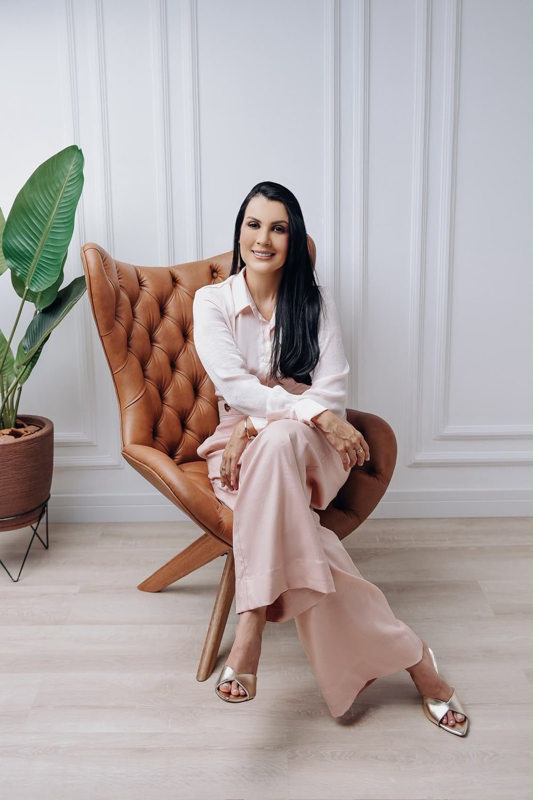
    

    
  

  DRA. MARCELLA MAIA — CRO-TO 1729
  
 ROLAR

</section>

<!-- ================= POSITIONING ================= -->
<section class="positioning section-pad">
  

    <h2 class="reveal">Beleza não é transformar. É revelar.</h2>
    

      
A harmonização facial deve respeitar a individualidade, as proporções e as características únicas de cada pessoa — um cuidado que valoriza, nunca substitui, quem você já é.

    

  

</section>

<!-- ================= SOBRE ================= -->
<section class="about section-pad" id="sobre">
  

    

      

      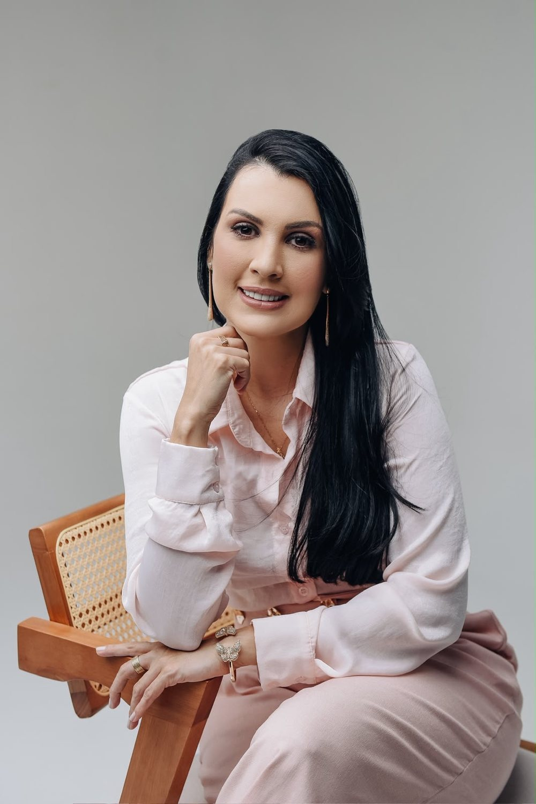
      

        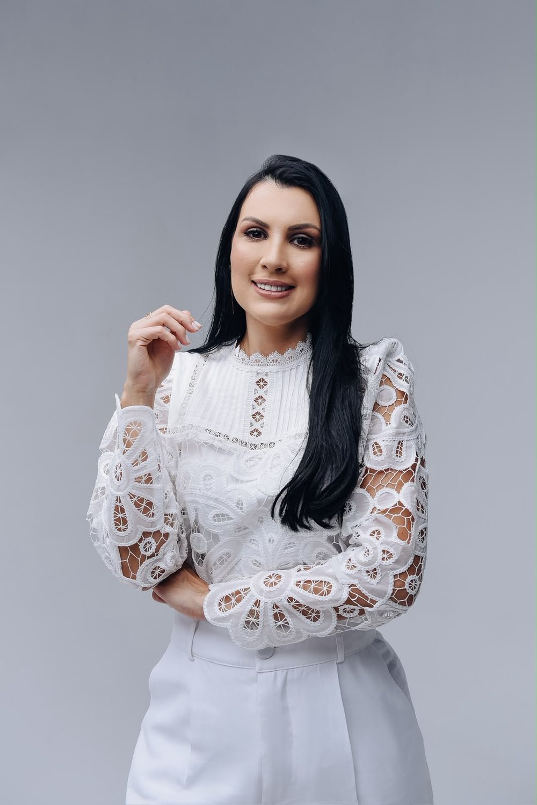
      

    

    

      

        02SOBRE
      

      <h2 class="reveal">Conheça a Dra. Marcella Maia</h2>
      
Cirurgiã-Dentista · CRO-TO 1729 · Residente em Harmonização Facial

      
Cada atendimento começa por um princípio simples: ouvir. Compreender as proporções, a expressão e a história de cada rosto antes de propor qualquer procedimento.

      
O planejamento é individualizado, com atenção aos detalhes e respeito ao tempo de cada paciente — sempre em busca do equilíbrio entre cuidado técnico e naturalidade.

      

        
Individualizado
Cada plano de cuidado é pensado a partir das características únicas do paciente.

        
Natural
Valorização da beleza própria, sem descaracterizar traços e expressões.

        
Detalhista
Atenção clínica dedicada a cada etapa do procedimento.

      

    

  

</section>

<!-- ================= PRESENÇA (GALERIA) ================= -->
<section class="presence section-pad">
  

    

      03PRESENÇA
    

    

      <h2 class="reveal">Um cuidado presente em cada detalhe.</h2>
      
Da avaliação ao acompanhamento, a mesma atenção dedicada em cada etapa.

    

    

      <figure class="p-tall">
        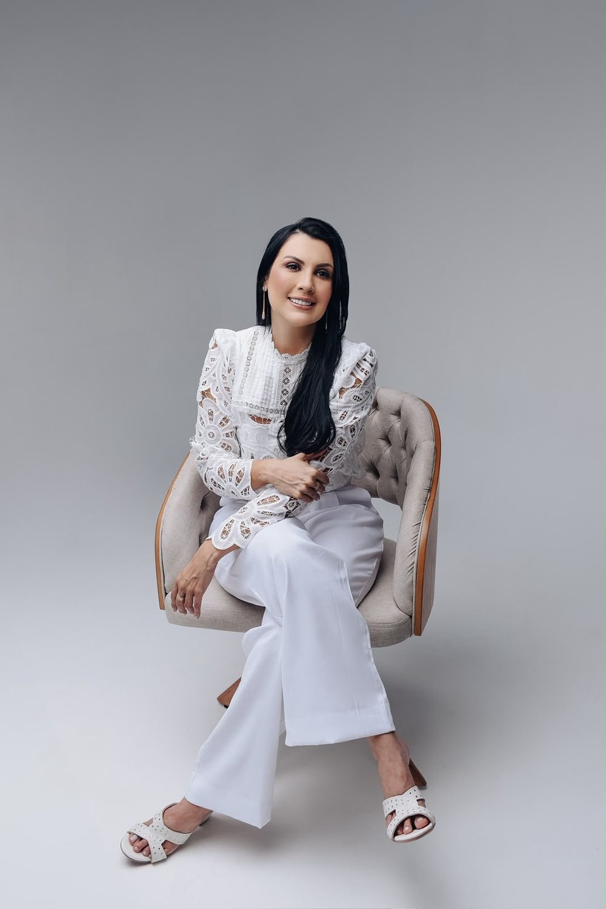
      </figure>
      <figure class="p-short">
        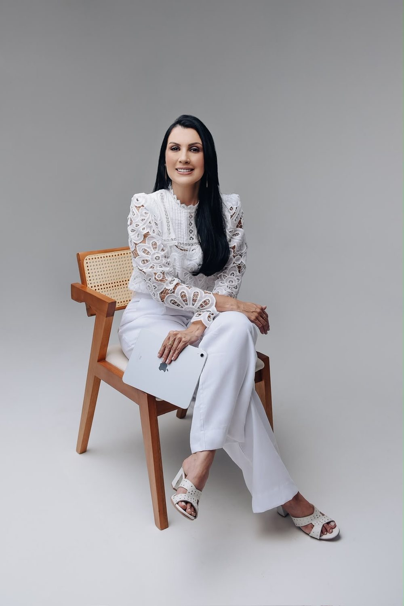
      </figure>
      <figure class="p-tall">
        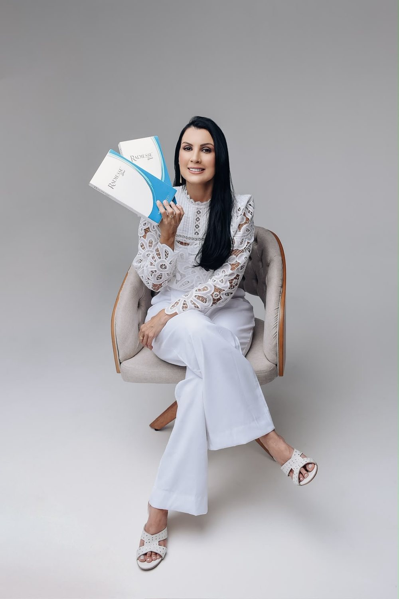
      </figure>
      <figure class="p-short">
        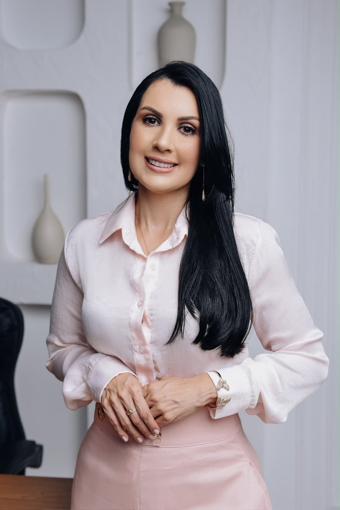
      </figure>
    

  

</section>

<!-- ================= PROCEDIMENTOS ================= -->
<section class="procedures section-pad" id="procedimentos">
  

    

      04PROCEDIMENTOS
    

    

      <h2 class="reveal">Precisão, cuidado e naturalidade em cada detalhe.</h2>
      
Toque em cada procedimento para conhecer mais.

    

    

      

        

          

            01
            <h3>Bioestimulador de Colágeno</h3>
            +
          

          

Procedimento voltado ao estímulo de colágeno e à melhora da qualidade e firmeza da pele.

        

        

          

            02
            <h3>Botox</h3>
            +
          

          

Procedimento utilizado para suavizar linhas de expressão e proporcionar uma aparência mais descansada.

        

        

          

            03
            <h3>Preenchimento Facial</h3>
            +
          

          

Técnica utilizada para harmonizar proporções e valorizar contornos faciais.

        

        

          

            04
            <h3>Microagulhamento</h3>
            +
          

          

Procedimento voltado à renovação e melhora da qualidade da pele.

        

        

          

            05
            <h3>Peptídeos</h3>
            +
          

          

Tratamentos voltados ao cuidado e à qualidade da pele.

        

        

          

            06
            <h3>Fios de PDO</h3>
            +
          

          

Técnica utilizada para estímulo de colágeno e melhora do suporte e contorno facial.

        

      

      

        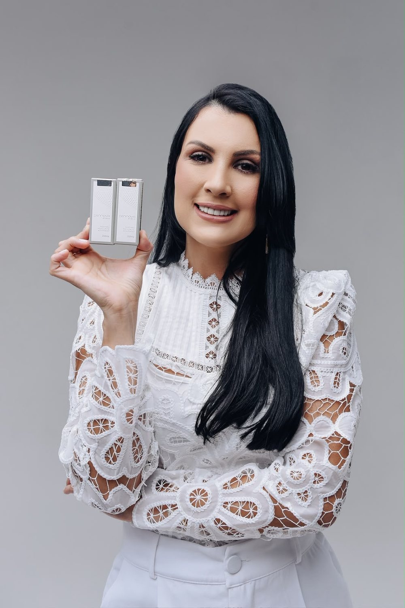
        Bioestimulador
      

    

  

</section>

<!-- ================= ABORDAGEM ================= -->
<section class="approach section-pad">
  

    

      05ABORDAGEM
    

    

      <h2 class="reveal">Harmonização com propósito.</h2>
    

    

      

        01
        <h3>Individualidade</h3>
        
Cada rosto possui características únicas.

      

      

        02
        <h3>Equilíbrio</h3>
        
Proporções e contornos devem conversar entre si.

      

      

        03
        <h3>Naturalidade</h3>
        
O objetivo é valorizar sem descaracterizar.

      

    

  

</section>

<!-- ================= RESULTADOS ================= -->
<section class="results section-pad" id="resultados">
  

    

      06RESULTADOS
    

    

      <h2 class="reveal">Resultados</h2>
    

    

      <figure class="result-photo">
        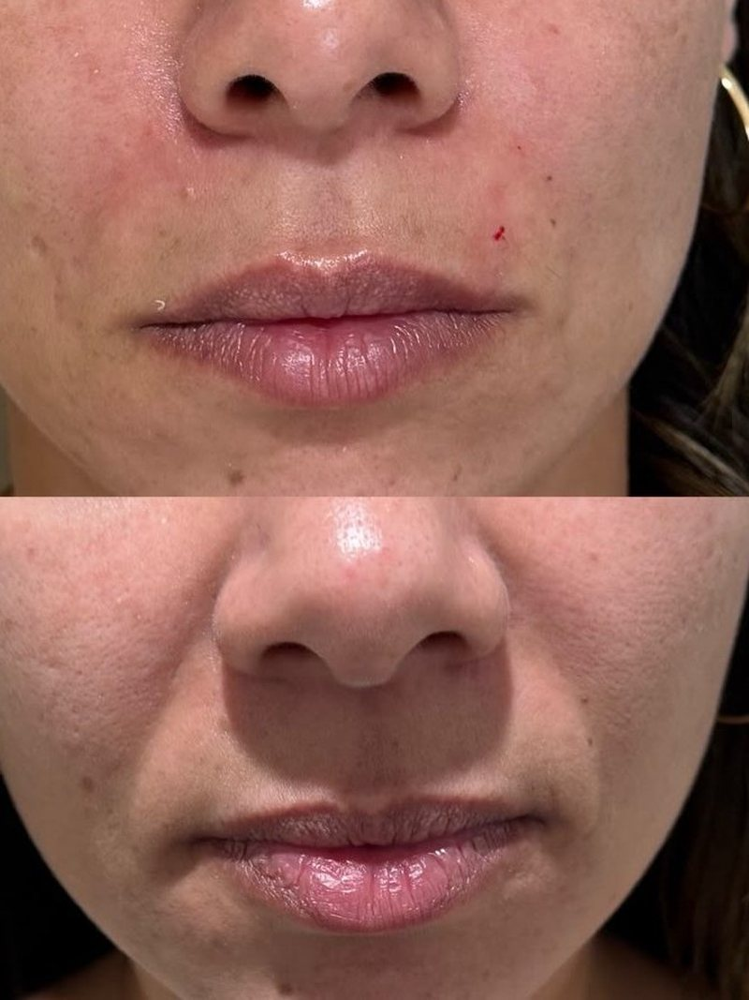
      </figure>
      <figure class="result-photo">
        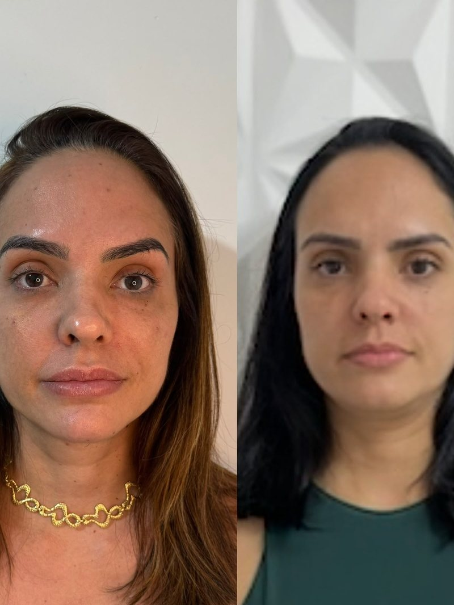
      </figure>
      <figure class="result-photo">
        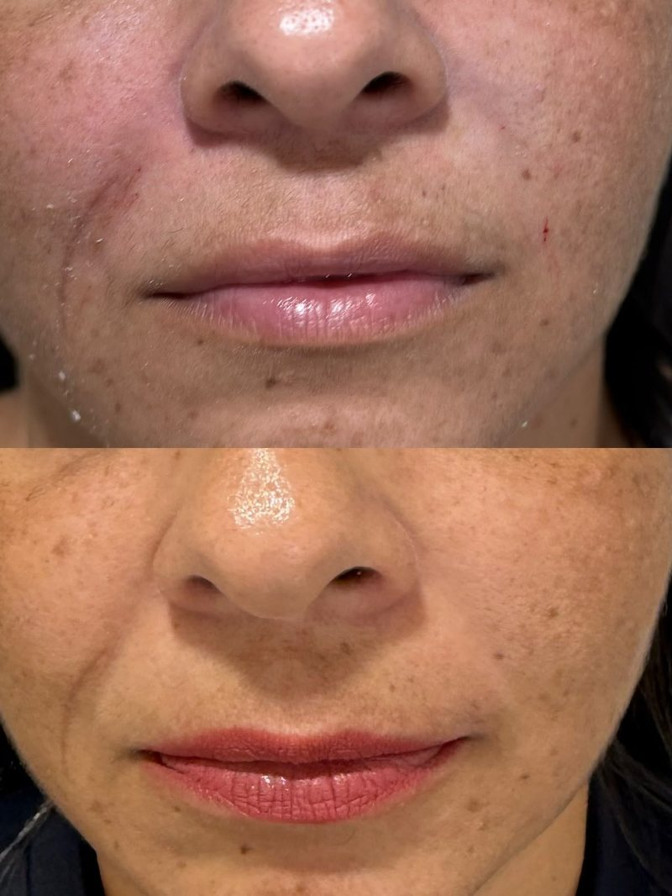
      </figure>
    

    
Os resultados podem variar de acordo com as características individuais de cada paciente.

  

</section>

<!-- ================= JORNADA ================= -->
<section class="journey section-pad">
  

    

      07ATENDIMENTO
    

    

      <h2 class="reveal">Um cuidado pensado para você.</h2>
    

    

      

        01
        <h3>Avaliação</h3>
        
Entendimento das necessidades e objetivos individuais.

      

      

        02
        <h3>Planejamento</h3>
        
Definição da abordagem mais adequada para cada caso.

      

      

        03
        <h3>Procedimento</h3>
        
Realização com cuidado, precisão e atenção aos detalhes.

      

      

        04
        <h3>Acompanhamento</h3>
        
Orientações e acompanhamento conforme a necessidade.

      

    

  

</section>

<!-- ================= IMPACT ================= -->
<section class="impact">
  <h2 class="reveal">Sua beleza não precisa ser reinventada. Ela precisa ser valorizada.</h2>
</section>

<!-- ================= FAQ ================= -->
<section class="faq section-pad" id="duvidas">
  

    

      

        08DÚVIDAS
      

      <h2>Perguntas frequentes</h2>
      
Reunimos as dúvidas mais comuns sobre avaliação e procedimentos.

    

    

      

        <button class="faq-q">Como funciona a avaliação?+</button>
        

A avaliação é o primeiro passo: um momento de escuta para entender suas necessidades e objetivos antes de qualquer indicação.

      

      

        <button class="faq-q">Qual procedimento é indicado para mim?+</button>
        

A indicação é sempre individualizada e definida durante a avaliação, de acordo com as características e objetivos de cada paciente.

      

      

        <button class="faq-q">Os procedimentos são personalizados?+</button>
        

Sim. Cada plano de tratamento é construído a partir das proporções e da individualidade de cada rosto.

      

      

        <button class="faq-q">Como funciona o preenchimento facial?+</button>
        

É uma técnica utilizada para harmonizar proporções e valorizar contornos faciais, sempre com planejamento individualizado.

      

      

        <button class="faq-q">Para que serve o Botox?+</button>
        

É utilizado para suavizar linhas de expressão e proporcionar uma aparência mais descansada.

      

      

        <button class="faq-q">Para que serve o bioestimulador de colágeno?+</button>
        

Estimula a produção de colágeno, contribuindo para a melhora da qualidade e firmeza da pele.

      

      

        <button class="faq-q">Posso combinar procedimentos?+</button>
        

A combinação de procedimentos é avaliada individualmente durante a consulta, conforme a indicação para cada caso.

      

      

        <button class="faq-q">Como funciona o agendamento?+</button>
        

O agendamento é feito diretamente pelo WhatsApp — basta tocar em "Agendar avaliação" em qualquer parte do site.

      

    

  

</section>

<!-- ================= INSTAGRAM ================= -->
<section class="instagram section-pad" id="instagram">
  

    

      09INSTAGRAM
    

    

      <h2 class="reveal">Acompanhe meu trabalho</h2>
      <a href="https://instagram.com/dramarcellamaiaa" target="_blank" rel="noopener" class="handle reveal">@dramarcellamaiaa</a>
    

    

      <a class="insta-tile" href="https://instagram.com/dramarcellamaiaa" target="_blank" rel="noopener" aria-label="Ver no Instagram">
        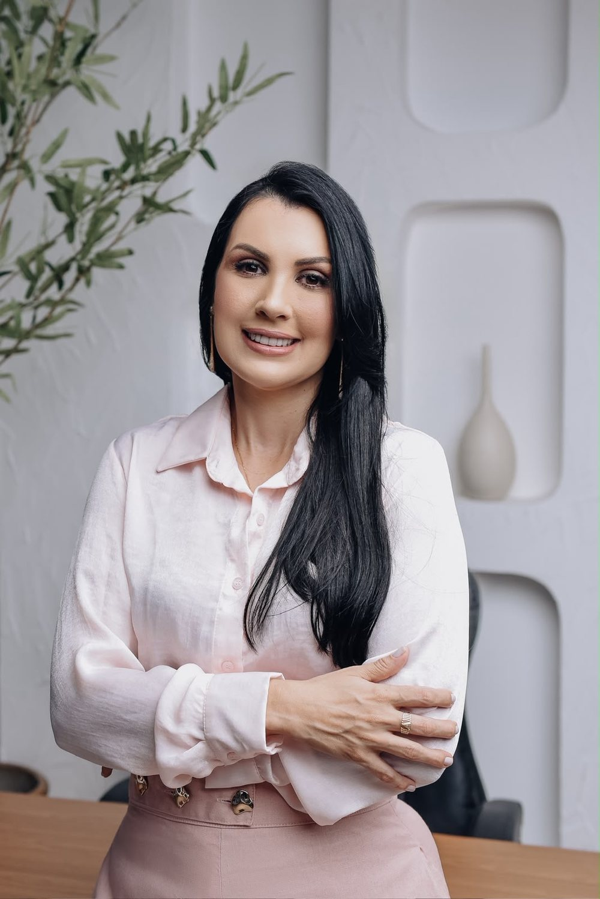
        <svg viewBox="0 0 24 24" fill="none" stroke="currentColor" stroke-width="1.4"><rect x="3" y="3" width="18" height="18" rx="5"/><circle cx="12" cy="12" r="4"/><circle cx="17.2" cy="6.8" r="0.6" fill="currentColor"/></svg>
      </a>
      <a class="insta-tile" href="https://instagram.com/dramarcellamaiaa" target="_blank" rel="noopener" aria-label="Ver no Instagram">
        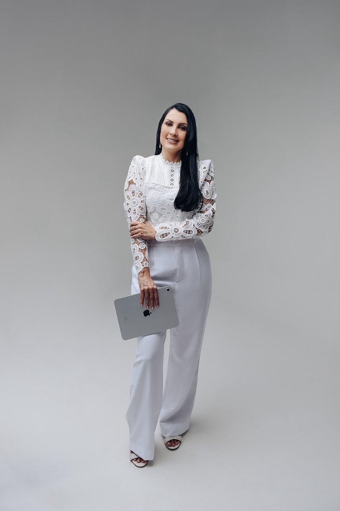
        <svg viewBox="0 0 24 24" fill="none" stroke="currentColor" stroke-width="1.4"><rect x="3" y="3" width="18" height="18" rx="5"/><circle cx="12" cy="12" r="4"/><circle cx="17.2" cy="6.8" r="0.6" fill="currentColor"/></svg>
      </a>
      <a class="insta-tile" href="https://instagram.com/dramarcellamaiaa" target="_blank" rel="noopener" aria-label="Ver no Instagram">
        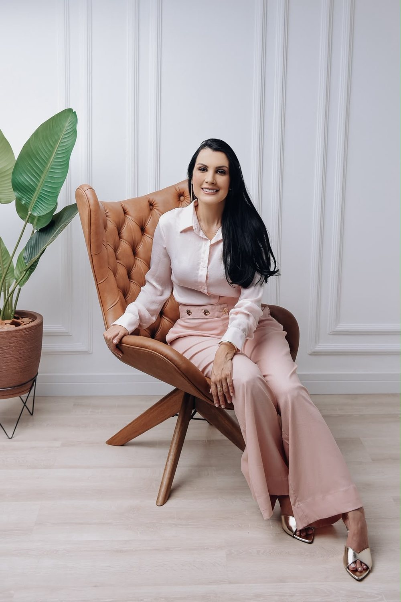
        <svg viewBox="0 0 24 24" fill="none" stroke="currentColor" stroke-width="1.4"><rect x="3" y="3" width="18" height="18" rx="5"/><circle cx="12" cy="12" r="4"/><circle cx="17.2" cy="6.8" r="0.6" fill="currentColor"/></svg>
      </a>
      <a class="insta-tile" href="https://instagram.com/dramarcellamaiaa" target="_blank" rel="noopener" aria-label="Ver no Instagram">
        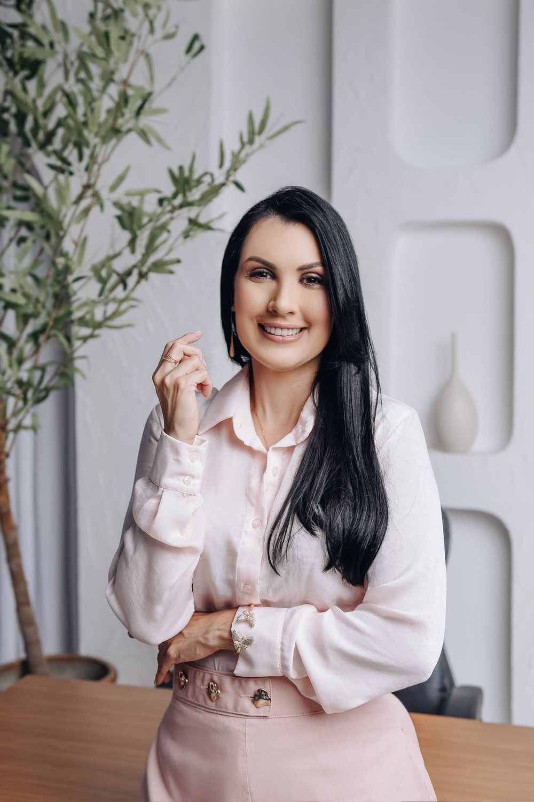
        <svg viewBox="0 0 24 24" fill="none" stroke="currentColor" stroke-width="1.4"><rect x="3" y="3" width="18" height="18" rx="5"/><circle cx="12" cy="12" r="4"/><circle cx="17.2" cy="6.8" r="0.6" fill="currentColor"/></svg>
      </a>
      <a class="insta-tile" href="https://instagram.com/dramarcellamaiaa" target="_blank" rel="noopener" aria-label="Ver no Instagram">
        
        <svg viewBox="0 0 24 24" fill="none" stroke="currentColor" stroke-width="1.4"><rect x="3" y="3" width="18" height="18" rx="5"/><circle cx="12" cy="12" r="4"/><circle cx="17.2" cy="6.8" r="0.6" fill="currentColor"/></svg>
      </a>
      <a class="insta-tile" href="https://instagram.com/dramarcellamaiaa" target="_blank" rel="noopener" aria-label="Ver no Instagram">
        
        <svg viewBox="0 0 24 24" fill="none" stroke="currentColor" stroke-width="1.4"><rect x="3" y="3" width="18" height="18" rx="5"/><circle cx="12" cy="12" r="4"/><circle cx="17.2" cy="6.8" r="0.6" fill="currentColor"/></svg>
      </a>
    

  

</section>

<!-- ================= CTA FINAL ================= -->
<section class="final-cta" id="contato">
  
  

    <h2 class="reveal">Seu rosto. Sua essência. Seu melhor detalhe.</h2>
    
Agende uma avaliação e descubra uma abordagem personalizada para valorizar sua beleza.

    <a href="https://wa.me/5563984636750?text=Ol%C3%A1%2C%20Dra.%20Marcella%21%20Gostaria%20de%20agendar%20uma%20avalia%C3%A7%C3%A3o." class="btn btn-primary reveal reveal-delay-2" target="_blank" rel="noopener">Agendar avaliação →</a>
  

</section>

<!-- ================= FOOTER ================= -->
<footer>
  

    

      

        
        
Cirurgiã-Dentista · CRO-TO 1729 · Residente em Harmonização Facial.

      

      

        <h4>PROCEDIMENTOS</h4>
        <ul>
          <li><a href="#procedimentos">Bioestimulador de colágeno</a></li>
          <li><a href="#procedimentos">Botox</a></li>
          <li><a href="#procedimentos">Preenchimento facial</a></li>
          <li><a href="#procedimentos">Microagulhamento</a></li>
          <li><a href="#procedimentos">Peptídeos</a></li>
          <li><a href="#procedimentos">Fios de PDO</a></li>
        </ul>
      

      

        <h4>CONTATO</h4>
        <ul>
          <li><a href="https://wa.me/5563984636750">(63) 98463-6750</a></li>
          <li><a href="mailto:marcellacalaca@gmail.com">marcellacalaca@gmail.com</a></li>
          <li><a href="https://instagram.com/dramarcellamaiaa" target="_blank" rel="noopener">@dramarcellamaiaa</a></li>
        </ul>
      

    

    

      ©  Dra. Marcella Maia. Todos os direitos reservados.
    

    
Os resultados dos procedimentos podem variar de acordo com as características individuais de cada paciente.

  

</footer>

<!-- WHATSAPP FLUTUANTE -->
<a href="https://wa.me/5563984636750?text=Ol%C3%A1%2C%20Dra.%20Marcella%21%20Gostaria%20de%20agendar%20uma%20avalia%C3%A7%C3%A3o." class="wa-float" target="_blank" rel="noopener" aria-label="Agendar avaliação pelo WhatsApp">
  <svg viewBox="0 0 24 24" fill="currentColor"><path d="M17.6 6.32A7.85 7.85 0 0 0 12.05 4a7.94 7.94 0 0 0-6.9 11.9L4 20l4.2-1.1a7.9 7.9 0 0 0 3.85 1h.01A7.94 7.94 0 0 0 20 12a7.9 7.9 0 0 0-2.4-5.68zm-5.55 12.2h-.01a6.6 6.6 0 0 1-3.36-.92l-.24-.14-2.5.65.67-2.44-.16-.25a6.6 6.6 0 1 1 5.6 3.1zm3.6-4.94c-.2-.1-1.17-.58-1.35-.64-.18-.07-.31-.1-.44.1-.13.2-.5.64-.62.77-.11.13-.23.15-.42.05a5.4 5.4 0 0 1-1.6-.98 6 6 0 0 1-1.1-1.37c-.12-.2 0-.3.09-.4.09-.1.2-.24.3-.36.1-.12.13-.2.2-.33.07-.13.03-.25-.02-.35-.05-.1-.44-1.06-.6-1.45-.16-.38-.32-.33-.44-.34h-.38c-.13 0-.34.05-.52.25-.18.2-.68.66-.68 1.6s.7 1.86.79 1.99c.1.13 1.37 2.1 3.33 2.94.46.2.83.32 1.11.4.47.15.9.13 1.24.08.38-.06 1.17-.48 1.34-.94.16-.46.16-.85.11-.94-.05-.09-.18-.14-.38-.24z"/></svg>
  Agendar avaliação
</a>

</body>
</html>
